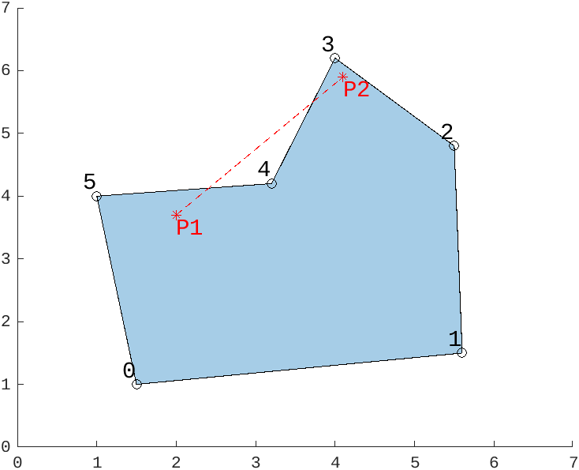
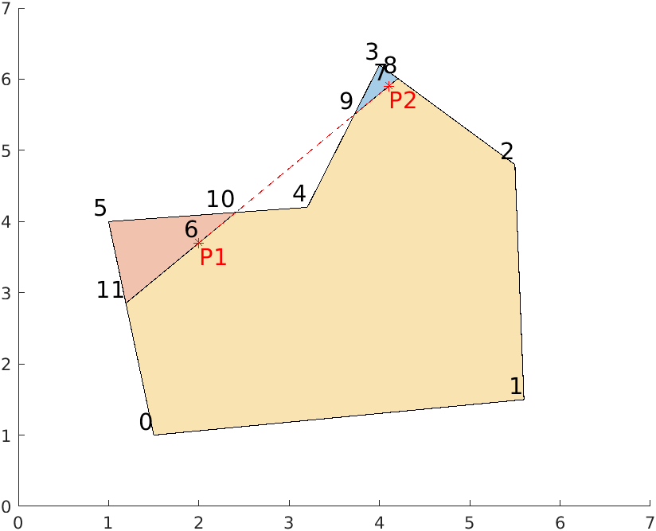
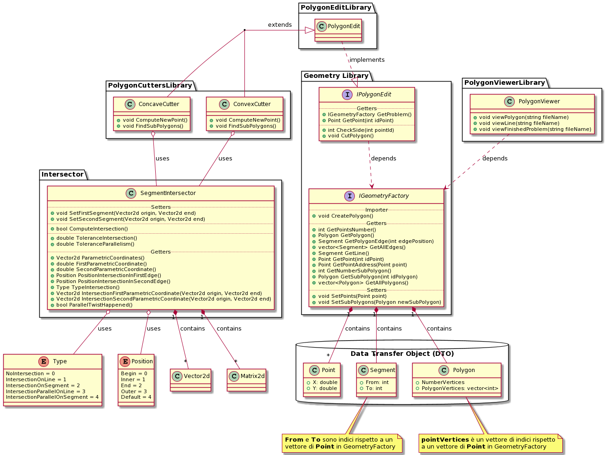

# Polygon Cut

Nella Scienza Computazionale, un importante compito è il taglio di un poligono in diverse parti.

## Code Requirements

L'obiettivo è creare una funzione con i seguenti requisiti:

* input:
	* `points`: una collezione di punti nello spazio 2D
	* `polygonVertices`: un poligono 2D, passato come collezione di indici dei vertici ordinati in senso antiorario
	* `segment`: una collezione di due punti nello spazio 2D, che rappresentano il segmento tagliante
* output:
	* `newPoints`: la collezione di nuovi punti risultanti, concatenata con la collezione di punti originali
	* `cuttedPolygons`: gli N poligoni derivati dal taglio del poligono originale, rappresentati come collezione di indici dei vertici ordinati in senso antiorario

### Example



In questo caso il file di input dovrebbe essere del tipo:
```Python
points = { {1.5, 1.0}; {5.6, 1.5}; {5.5, 4.8}; {4.0, 6.2}; {3.2, 4.2}; {1.0, 4.0} }
polygonVertices = { 0, 1, 2, 3, 4, 5 }
segment = { {2.0, 3.7}; {4.1, 5.9} }
```

I poligoni risultati dal taglio saranno:



```Python
newPoints = { {1.5, 1.0}; {5.6, 1.5}; {5.5, 4.8}; {4.0, 6.2}; {3.2, 4.2}; {1.0, 4.0}; {2.0, 3.7}; {4.1, 5.9}; {4.204, 6.009}; {3.721, 5.503}; {2.409, 4.128}; {1.191, 2.853} }
subPolygon = { { 2, 8, 7, 9, 4, 10, 6, 11, 0, 1 }; { 3, 9, 7, 8 }; { 5, 11, 6, 10 } }
```

## Code Design



### Methods description
* GeometryFactory:
	* `CreatePolygon()`: crea il poligono iniziale e la retta tagliante per il calcolo del taglio

* PolygonEdit:
	* `CheckSide(idPoint, line)`: ritorna un intero del set { -1, 0, 1 }, che etichetta la posizione di un punto rispetto al segmento considerato (destra, sul segmento, sinistra), se non specificato negli input della funzione, si considera come "line" il segmento tagliante
	* `CutPolygon()`: calcola i subpoligoni generati dal taglio del poligono iniziale con il segmento tagliante

* ConvexCutter: caso particolare per poligoni convessi
	* `ComputeNewPoints()`: calcola le intersezioni dei lati del poligono con la retta tagliante, aggiungendoli agli altri punti del problema nella classe GeometryFactory; inoltre definisce una struttura dati che contiene tutti i punti sul bordo del poligono e una che contiene i punti sulla retta tagliante
	* `FindSubPolygons()`: si avvale di chiamate ricorsive a metodi privati per trovare dei cicli nel grafo che descrive il poligono iniziale e definire i subpoligoni originati dal taglio

* ConcaveCutter: in generale e per poligoni concavi
	* `ComputeNewPoints()`: calcola le intersezioni dei lati del poligono con la retta tagliante, aggiungendoli agli altri punti del problema nella classe GeometryFactory; inoltre definisce una struttura dati che contiene tutti i punti sul bordo del poligono e una che contiene i punti sulla retta tagliante
	* `FindSubPolygons()`: si avvale di chiamate ricorsive a metodi privati per trovare dei cicli nel grafo che descrive il poligono iniziale e definire i subpoligoni originati dal taglio

* SegmentIntersector:
	* `SetFirstSegment(origin, end)`: setta i punti che definiscono l'inizio e la fine del primo segmento
	* `SetSecondSegment(origin, end)`: setta i punti che definiscono l'inizio e la fine del secondo segmento
	* `ComputeIntersection()`: calcola le coordinate delle intersezioni tra la retta passante per il primo segmento(segmento tagliante) e il secondo segmento (lato del poligono) e ritorna
 un booleano, True se esiste intersezione,False altrimenti
	* `ToleranceIntersection()`: ritorna la tolleranza usata nel calcolo delle intersezioni
	* `ToleranceParallelism()`: ritorna la tolleranza usata per verificare che ci sia o meno parallelismo 
	* `ParametricCoordinates()`: ritorna un vettore contenente le coordinate parametriche dell'intersezione rispetto all'origine dei segmenti
	* `FirstParametricCoordinate()`: ritorna le coordinate parametriche dell'intersezione rispetto all'origine del primo segmento
	* `SecondParametricCoordinate()`: ritorna le coordinate parametriche dell'intersezione rispetto all'origine del secondo segmento
	* `PositionIntersectionInFirstEdge()`: ritorna la posizione dell'intersezione rispetto al primo segmento
	* `PositionIntersectionInSecondEdge()`: ritorna la posizione dell'intersezione rispetto al secondo segmento
	* `TypeIntersection()`: ritorna il tipo dell'intersezione
	* `IntersectionFirstParametricCoordinate(Vector2d origin, Vector2d end)`: prende in input l'origine e la fine del primo segmento e ritorna il punto di intersezione (coordinate x, y)
	* `IntersectionSecondParametricCoordinate(Vector2d origin, Vector2d end)`: in caso di intersezione di tipo 1 e 2 (rispettivamente intersezione propria sulla retta o sul segmento) prende in input l'origine e la fine del secondo segmento e ritorna il punto di intersezione (coordinate x, y), mentre nel caso di intersezione di tipo 3 e 4 (rispettivamente intersezione parallela sulla retta o sul segmento) prende in input l'origine e la fine del primo segmento e ritorna l'origine e la fine del secondo segmento rispetto agli estremi del primo segmento
	* `ParallelTwist()`: ritorna True se il primo e secondo segmento sono paralleli ma hanno verso opposto

* PolygonViewer:
	* `viewPolygon(fileName)`: crea un file .m per rappresentare il poligono iniziale e la retta tagliante
	* `viewLine(fileName)`: crea un file .m per rappresentare la retta tagliante
	* `viewFinishedProblem(fileName)`:  crea un file .m per rappresentare il risultato del processo di taglio

