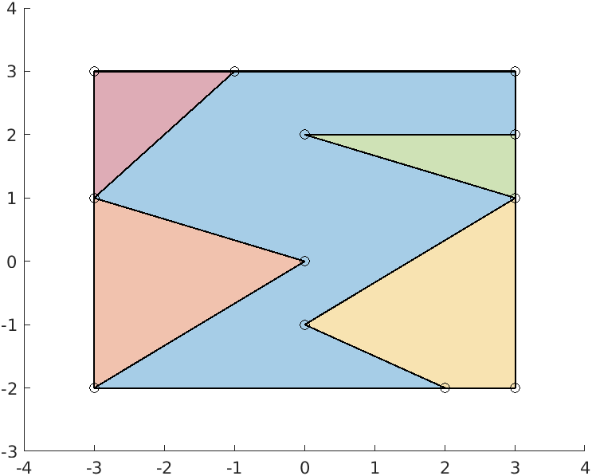

# Polygon Mesh

## Code Requirements

L'obiettivo è creare una funzione con i seguenti requisiti:

* input:
	* `domain`: un poligono convesso nello spazio 2D, passato come collezione di punti ordinati in senso antiorario
	* `cell`: un elemento di riferimento, costituito da un poligono centrale racchiuso in un bounding box rettangolare, di cui si passa il solo poligono centrale
* output:
	* `mesh`: la collezione di poligoni risultanti che costituiscono la mesh, cioè che rivestono completamente il dominio senza sovrapposizioni e con opportuni tagli dell'elemento di riferimento

### Example





In questo caso i dati di input dovrebbero essere del tipo:
```Python
domain = { {20.0, 0.0}; {40.0, 20.0}; {20.0, 40.0}; {0.0, 20.0} }
centralPolygonPoints = { {2.0, -2.0}; {0.0, -1.0}; {3.0, 1.0}; {0.0, 2.0}; {3.0, 2.0}; {3.0, 3.0}; {-1.0, 3.0}; {-3.0, 1.0}; {0.0, 0.0}; {-3.0, -2.0} }
```

I poligoni risultati dal calcolo della mesh saranno:


## Code Design


### Methods description
* GeometryFactory:
	* `CreatePolygon()`: crea il poligono iniziale e la retta tagliante per il calcolo del taglio

* PolygonEdit:
	* `CheckSide(idPoint, line)`: ritorna un intero del set { -1, 0, 1 }, che etichetta la posizione di un punto rispetto al segmento considerato (destra, sul segmento, sinistra), se non specificato negli input della funzione, si considera come "line" il segmento tagliante
	* `CutPolygon()`: calcola i subpoligoni generati dal taglio del poligono iniziale con il segmento tagliante

* ConvexCutter: caso particolare per poligoni convessi
	* `ComputeNewPoints()`: calcola le intersezioni dei lati del poligono con la retta tagliante, aggiungendoli agli altri punti del problema nella classe GeometryFactory; inoltre definisce una struttura dati che contiene tutti i punti sul bordo del poligono e una che contiene i punti sulla retta tagliante
	* `FindSubPolygons()`: si avvale di chiamate ricorsive a metodi privati per trovare dei cicli nel grafo che descrive il poligono iniziale e definire i subpoligoni originati dal taglio

* ConcaveCutter: in generale e per poligoni concavi
	* `ComputeNewPoints()`: calcola le intersezioni dei lati del poligono con la retta tagliante, aggiungendoli agli altri punti del problema nella classe GeometryFactory; inoltre definisce una struttura dati che contiene tutti i punti sul bordo del poligono e una che contiene i punti sulla retta tagliante
	* `FindSubPolygons()`: si avvale di chiamate ricorsive a metodi privati per trovare dei cicli nel grafo che descrive il poligono iniziale e definire i subpoligoni originati dal taglio

* SegmentIntersector:
	* `SetFirstSegment(origin, end)`: setta i punti che definiscono l'inizio e la fine del primo segmento
	* `SetSecondSegment(origin, end)`: setta i punti che definiscono l'inizio e la fine del secondo segmento
	* `ComputeIntersection()`: calcola le coordinate delle intersezioni tra la retta passante per il primo segmento(segmento tagliante) e il secondo segmento (lato del poligono) e ritorna
 un booleano, True se esiste intersezione,False altrimenti
	* `ToleranceIntersection()`: ritorna la tolleranza usata nel calcolo delle intersezioni
	* `ToleranceParallelism()`: ritorna la tolleranza usata per verificare che ci sia o meno parallelismo 
	* `ParametricCoordinates()`: ritorna un vettore contenente le coordinate parametriche dell'intersezione rispetto all'origine dei segmenti
	* `FirstParametricCoordinate()`: ritorna le coordinate parametriche dell'intersezione rispetto all'origine del primo segmento
	* `SecondParametricCoordinate()`: ritorna le coordinate parametriche dell'intersezione rispetto all'origine del secondo segmento
	* `PositionIntersectionInFirstEdge()`: ritorna la posizione dell'intersezione rispetto al primo segmento
	* `PositionIntersectionInSecondEdge()`: ritorna la posizione dell'intersezione rispetto al secondo segmento
	* `TypeIntersection()`: ritorna il tipo dell'intersezione
	* `IntersectionFirstParametricCoordinate(Vector2d origin, Vector2d end)`: prende in input l'origine e la fine del primo segmento e ritorna il punto di intersezione (coordinate x, y)
	* `IntersectionSecondParametricCoordinate(Vector2d origin, Vector2d end)`: in caso di intersezione di tipo 1 e 2 (rispettivamente intersezione propria sulla retta o sul segmento) prende in input l'origine e la fine del secondo segmento e ritorna il punto di intersezione (coordinate x, y), mentre nel caso di intersezione di tipo 3 e 4 (rispettivamente intersezione parallela sulla retta o sul segmento) prende in input l'origine e la fine del primo segmento e ritorna l'origine e la fine del secondo segmento rispetto agli estremi del primo segmento
	* `ParallelTwist()`: ritorna True se il primo e secondo segmento sono paralleli ma hanno verso opposto

* PolygonViewer:
	* `viewPolygon(fileName)`: crea un file .m per rappresentare il poligono iniziale e la retta tagliante
	* `viewLine(fileName)`: crea un file .m per rappresentare la retta tagliante
	* `viewFinishedProblem(fileName)`:  crea un file .m per rappresentare il risultato del processo di taglio

* PolygonAdvanced:
	* `ComputeArea()`: calcola l'area del poligono
	* `PrintDebug(filepath)`: crea un file .m su matlab con i comandi che permettono di plottare un poligono

* ReferenceElt:
	* `Translate(x, y)`: trasla tutti i punti dei poligoni che lo costituiscono e del boundingBox di un vettore (x, y)
	* `IntTranslate(n, m)`: trasla tutti i punti dei poligoni che lo costituiscono e del boundingBox di un vettore (n*x, m*y) dove x e y sono le dimensioni del bounding box
	* `PrintDebug(filepath)`: crea un file .m su matlab con i comandi che permettono di plottare un poligono e il suo corrispondente boundingBox

* AdvancedMesh:
	* `ComputeMesh()`: metodo void che raccoglie e chiama tutti i metodi privati che permettono di ricoprire il dominio con la mesh

* AdvancedPolygonViewer:
	* `ViewDomain()`: crea un file .m per plottare il dominio della mesh su matlab
	* `ViewMesh()`: crea un file .m per plottare la mesh prima del taglio
	* `ViewOutputMesh()`: crea un file .m per plottare la mesh dopo il taglio

